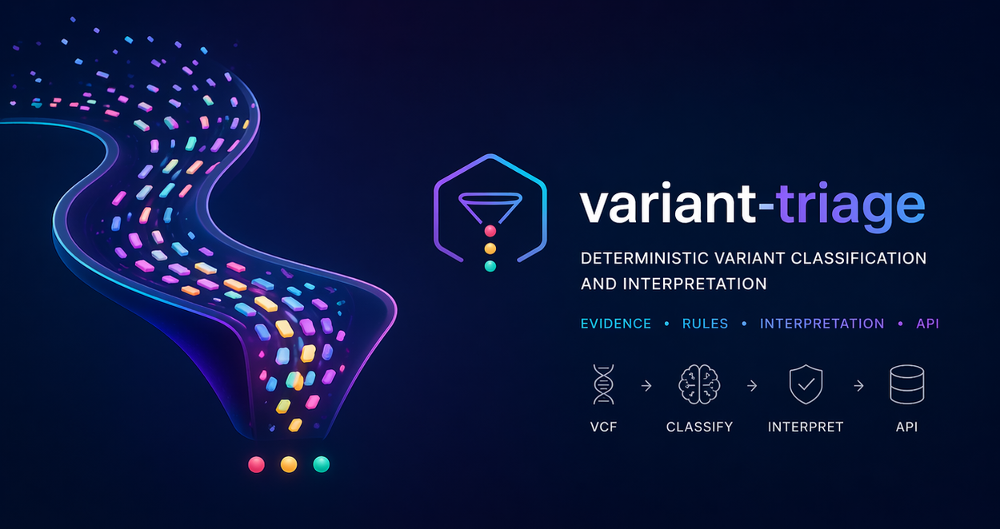
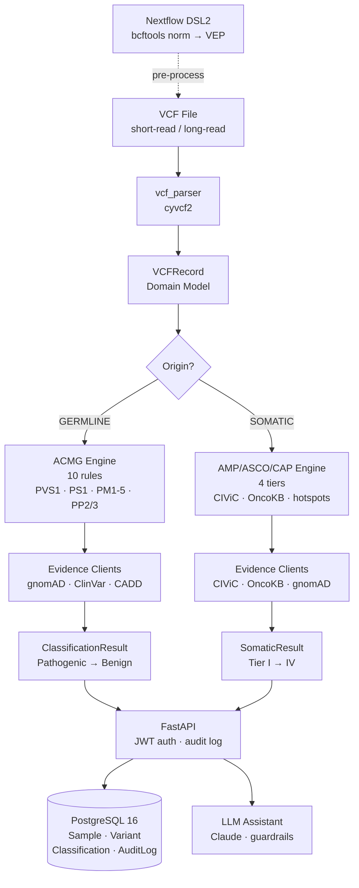

# variant-triage



A backend service for **deterministic, evidence-grounded variant classification and interpretation**.

Unlike typical LLM-driven tools that generate plausible outputs, this system constrains reasoning through structured rules (ACMG/AMP), curated evidence (ClinVar, gnomAD), and explicit decision paths to produce **reproducible, auditable results**.

Designed to model how clinical genomics workflows can be implemented as **testable, production-style software systems** rather than ad hoc analysis pipelines.

> Most LLM approaches generate plausible interpretations. This system is designed to produce reproducible ones.

**Stack:** Python 3.12 · FastAPI · PostgreSQL 16 · SQLAlchemy 2 · Nextflow DSL2 · Docker · Fly.io

> **This is a portfolio project using only synthetic data. See [CLINICAL_DISCLAIMER.md](CLINICAL_DISCLAIMER.md).**

---

## Live Demo

- **API:** https://variant-triage.fly.dev
- **Swagger UI:** https://variant-triage.fly.dev/docs
- **Health check:** https://variant-triage.fly.dev/health

> The app may take ~30 seconds to wake from cold start on the free tier.

---

## Documentation

- [OVERVIEW.md](OVERVIEW.md) - plain-English explanation of what this project does and why
- [TUTORIAL.md](TUTORIAL.md) - end-to-end walkthrough with curl examples
- [SECURITY_CONSIDERATIONS.md](SECURITY_CONSIDERATIONS.md) - compliance and security notes
- [CLINICAL_DISCLAIMER.md](CLINICAL_DISCLAIMER.md) - research-only status

---

## Why this matters

Variant interpretation is not just about generating an answer — it is about producing results that can be **trusted, reproduced, and audited**.

Most current approaches fall into two categories:

- **Rule-based pipelines** — deterministic but rigid and hard to extend  
- **LLM-driven tools** — flexible but opaque and difficult to validate  

This project explores a third approach:

> **Controlled reasoning** — combining deterministic classification logic with constrained LLM assistance to produce outputs that are both flexible and reliable.

## Overview

Variant interpretation is often performed through a combination of pipelines, scripts, and manual review. This project explores how that process can be expressed as a structured application with deterministic classification logic, explicit data models, traceable decision-making, and a consistent API surface.

The goal is to bridge the gap between **bioinformatics workflows** and **production-facing services** used in clinical or translational settings.

---

## What this demonstrates

- **Controlled LLM reasoning** - model outputs are constrained, validated, and grounded in curated evidence rather than free-form generation

- **End-to-end system design** - VCF ingestion through classification, LLM-assisted interpretation (with guardrails and constrained outputs), and REST API exposure
- **Separation of concerns** - clear boundaries between domain logic, persistence, and API layer
- **Reproducibility and testability** - deterministic classification logic with 170+ tests and full CI
- **Operational awareness** - JWT authentication, audit logging, containerised deployment with CI/CD
- **Clinical domain knowledge** - ACMG/AMP 2015 germline rules, AMP/ASCO/CAP somatic tiering, ClinVar and gnomAD evidence integration
- **Extensibility** - plugin architecture for classification rules, protocol-based evidence sources

---

## Architecture



---

## Design decisions

- **Classification logic as pure functions** - deterministic behaviour, straightforward to test in isolation
- **Plugin architecture for ACMG rules** - each rule is an independent class implementing a common interface, making additions and overrides explicit
- **Async evidence clients with in-memory caching** - gnomAD GraphQL and ClinVar E-utilities run concurrently per variant, results cached to avoid duplicate lookups within a batch
- **Audit logging with SHA-256 payload hashing** - tamper-evident record of all requests without storing raw patient data
- **LLM guardrails** - regex-based checks on model output prevent diagnosis statements and treatment recommendations from reaching callers
- **Graceful degradation** - OncoKB and the LLM assistant both degrade to no-op if API tokens are absent, keeping the core classifier functional

---

## Quickstart

### Prerequisites

- Docker ≥ 24 and Docker Compose v2
- Python 3.12 (for local development)

### Run with Docker Compose

```bash
git clone https://github.com/plobb/variant-triage
cd variant-triage
cp .env.example .env
# Set SECRET_KEY in .env

docker-compose up --build
```

API available at `http://localhost:8000`. Swagger UI at `http://localhost:8000/docs`.

### Local development

```bash
python -m venv .venv
source .venv/bin/activate
pip install -r requirements.txt

cp .env.example .env
# Edit .env with your database URL and secret key

alembic upgrade head
uvicorn app.api.main:app --reload
```

---

## Testing

```bash
# Run all 170+ tests
pytest tests/

# With coverage report
pytest tests/ --cov=app --cov-report=term-missing

# Type checking
mypy --strict app/

# Lint
ruff check app/ tests/
```

---

## Project roadmap

| Phase | Scope | Status |
|---|---|---|
| **1 - Foundation** | Domain models, VCF parser (short + long-read), DB schema, CI | ✅ Complete |
| **2 - API layer** | FastAPI routes, JWT auth, audit logging middleware | ✅ Complete |
| **3 - ACMG engine** | 10-rule germline classifier, gnomAD + ClinVar evidence clients | ✅ Complete |
| **4 - Somatic** | AMP/ASCO/CAP tiering, CIViC + OncoKB evidence clients | ✅ Complete |
| **5 - Nextflow** | DSL2 pipeline: bcftools normalise → VEP annotation | ✅ Complete |
| **6 - LLM assistant** | Claude-powered interpretation drafts with clinical guardrails | ✅ Complete |
| **7 - Deployment** | Fly.io deploy, GitHub Actions CI/CD, security documentation | ✅ Complete |

---

## Related work

- [celltype-agent](https://github.com/plobb/celltype-agent) - agentic cell type annotation for single-cell and spatial genomics data (10x Chromium, Visium, Xenium) using Claude and curated marker databases
